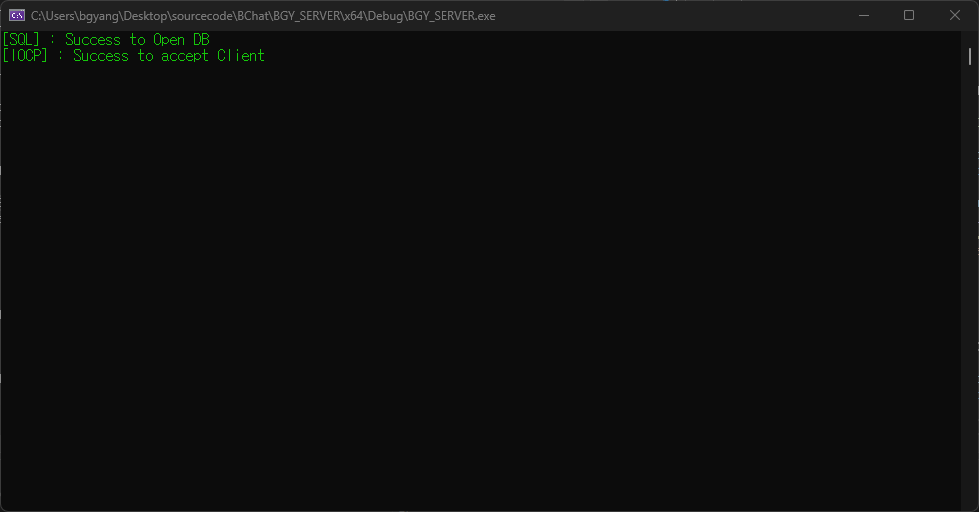
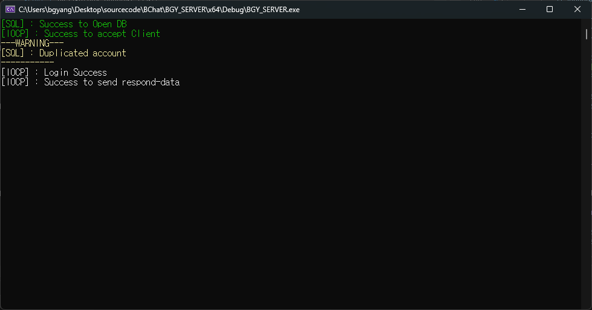
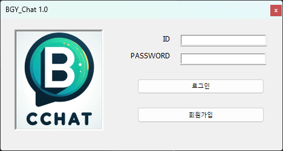
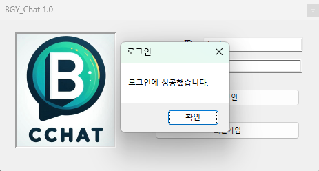
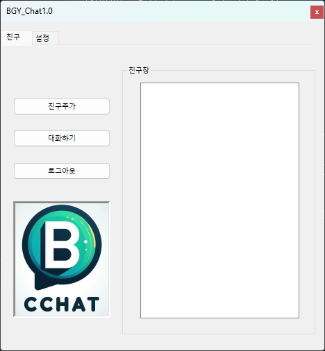

# BCHAT 1.0
* 개발 기간 : 1주 ~ 아직 개발 중  
* OS : Window 10  
* 개발도구 : Visual Studio 2022, SQLite3, MFC  
* 내용 : 예전 소켓 프로그래밍 공부 하면서, 이해했던 IOCP 서버와 이번에 MFC 프레임워크에 익숙해지고자 간단한 메신저 프로그래밍 제작

## 서버
### <U>역할</U> :
1.	클라이언트와 연결/전송 등 네트워크 통신 담당
2.	DB 서버도 동시에 담당 (SQLIite3) 

 
 
## 클라이언트
### <U>클라이언트 역할</U> :
1.	GUI 기반 편의성 담당
2.	로그인(회원가입) 담당
3.	친구 추가/메신저 보내기/설정 담당
 

